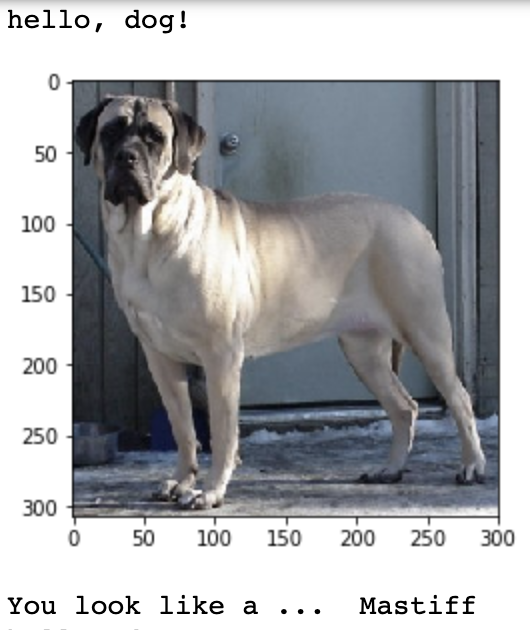

# Classifying Dog Breeds
This project was completed as part of Udacity's Machine Learning NanoDegree program (Capstone Project)

Author: Nadine Amersi-Belton

## Problem Statement
The problem is a multi-class classification problem in the field of computer vision. There are two aspects to the problem:
1. Given an image of a dog, we want our model to accurately predict the dog’s breed
2. Given an image of a human face, we want our model to identify the closest resembling dog breed.

## Data
The data have been provided by Udacity. A link to download the datasets can be found in the Jupyter Notebook.

Dog images dataset: The data has been already split into three folders, for train, test and validation purposes. Each folder is further subdivided into 133 folders representing the different dog breeds we are seeking to classify. Note that we are dealing with imbalanced data as there is not the same number of images for each class (breed).

Human images dataset: The data has been split into folders according to names. There are a total of 13233 human face images divided into 5749 folders. Again we note that there is not the same number of images in each folder.

## Methodology

* To detect human faces, OpenCV Haar Cascade classifiers were used.
* To detect dogs, a VGG16 model pretrained on Imagenet data was chosen.
* To detect breeds, both a CNN from scratch and a transfer learning model using VGG16 were implemented.

## Results

Using the CNN from scratch method, a test accuracy of 15% was achieved.
With the help of transfer learning tools and in particular a pretrained VGG16 model, the test accuracy increased to 80%.

## Sample Output

## Contact

* If you have any questions, you can contact me at nzamersi@gmail.com